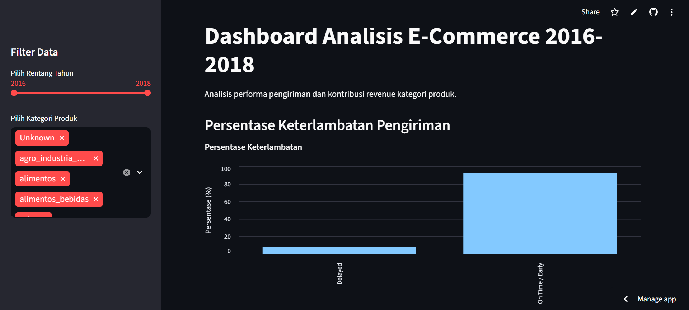
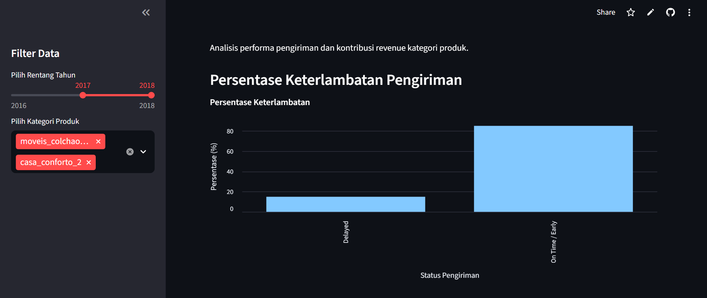
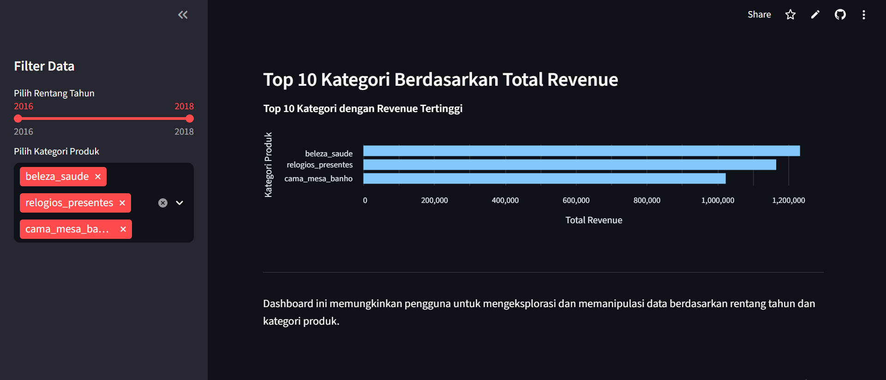

# End-to-End Data Analysis Project: E-Commerce Performance (2016-2018)

I recently completed a data analysis project exploring e-commerce operational and revenue performance.

## Business Questions:

- How did delivery performance (delivery time and delays) for orders with delivered status vary during 2016-2018, and which product categories most frequently experienced delays?
- Which product categories generated the highest revenue during 2016-2018, and how did their sales trends evolve over time?

## What I Did:

- Data Wrangling (Gathering, Assessing, and Cleaning)
- Exploratory Data Analysis (EDA)
- Feature engineering (delivery time, delay flag, revenue aggregation)
- Built an interactive dashboard using Streamlit
- Deployed to Streamlit Cloud

## Key Insights:

- Logistics performance improved consistently from 2016 to 2018, with average delivery time decreasing and delay rates remaining low, indicating stronger operational efficiency. However, several extreme delivery outliers persisted, and large-product categories such as moveis_colchao_e_estofado and casa_conforto_2 recorded the highest delay rates.
- Revenue grew rapidly during 2016–2018, reflecting strong expansion and increasing demand, with beleza_saude, relogios_presentes, and cama_mesa_banho as the main contributors. Revenue distribution remained diversified, while Champions and Loyal Customers generated significantly higher revenue than one-time buyers.

## Tools:

Python, Altair, Matplotlib, NumPy, Pandas, Seaborn, Streamlit, Git, and GitHub.

## Live Dashboard:

https://submission-kf8l4it5krvlxdfuttfsdh.streamlit.app/

## Dashboard Preview





## AI Attribution/Acknowledgements

Ideas and Concepts: I utilized ChatGPT to brainstorm necessary features based on the business context of my project, specifically using the E-Commerce Public Dataset.

Syntax and Debugging: I utilized ChatGPT to refine and debug my code, ensuring all scripts were properly adjusted to align with standard Python syntax.

Interpretation: I utilized ChatGPT to better understand the dataset through a business lens, which helped me identify key insights during the data analysis process.

Note: All code has been personally tested and modified.

## Directory Structure

```
submission
├───dashboard
| ├───main_data.csv
| └───dashboard.py
├───data
| ├───orders_dataset.csv
| ├───order_items_dataset.csv
| ├───customers_dataset.csv
| └───products_dataset.csv
├───Proyek_Analisis_Data.ipynb
├───README.md
└───requirements.txt
└───url.txt
```

## Setup Environment - Anaconda 

```
conda create --name main-ds python=3.9
conda activate main-ds
pip install -r requirements.txt
```

## Setup Environment - Shell/Terminal 

```
python -m venv venv
venv\Scripts\activate
pip install -r requirements.txt
```

## Run Streamlit App 

Run from the project root directory:

```
streamlit run dashboard/dashboard.py
```

The application will run at:

```
http://localhost:8501
```
